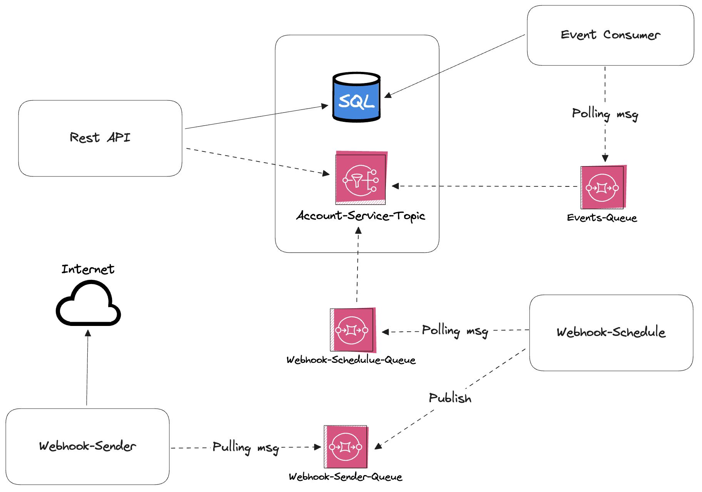

# Account Service

## About
This is a symbolic project for training and learning [GoLang](https://go.dev/).

The main purpose of the project is to serve as a microservice that provides simple authentication and authorization mechanism. The project is based in [event-driven architecture(EDA)](https://aws.amazon.com/event-driven-architecture/) and [clean architecture](https://www.freecodecamp.org/news/a-quick-introduction-to-clean-architecture-990c014448d2/) principles.

The project provides a REST API for synchronous communication. For asynchronous communication, it utilizes [AWS SNS](https://aws.amazon.com/pt/sns/) and [webhooks](https://www.redhat.com/pt-br/topics/automation/what-is-a-webhook).




## Dependencies

- [GoLang 1.21](https://go.dev/)
- [Postgres](https://www.postgresql.org/)
- [AWS SNS](https://aws.amazon.com/pt/sns/)
- [AWS SQS](https://aws.amazon.com/pt/sqs/)
- [Docker](https://www.docker.com/)*
- [Docker Compose](https://docs.docker.com/compose/)*
- [LocalStack](https://www.localstack.cloud/)*

*. Development mode

## Setup

In development mode, you need to duplicate `.env.dev` file and rename it to `.env`. Feel free to change any value in your new `.env` file just in case.

```shell
# installing dependencies
go mod download

# starting infrastructure dependencies
docker-composer up -D

# starting rest api
go run cmd/rest-api/main.go

# starting events consumer
go run cmd/event-consumer/main.go

# starting webhook schedule
go run cmd/webhook-schedule/main.go

# starting webhook sender
go run cmd/webhook-sender/main.go
```

## Infos

- To see API endpoints and payloads, access this [directory](./docs/api-endpoints/)
- To see all the events, check [this file](./internal/event/event.go) out.
